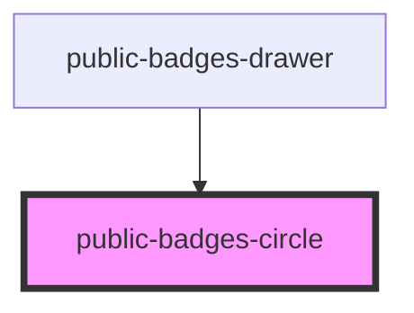

# public-badges-circle

<!-- Auto Generated Below -->

## Properties

| Property      | Attribute      | Description | Type     | Default  |
| ------------- | -------------- | ----------- | -------- | -------- |
| `badgesCount` | `badges-count` |             | `number` | `1`      |
| `colorMode`   | `color-mode`   |             | `string` | `"dark"` |

## Dependencies

### Used by

 - [public-badges-drawer](../public-badges-drawer)

### Graph

----------------------------------------------

*Built with [StencilJS](https://stenciljs.com/)*
