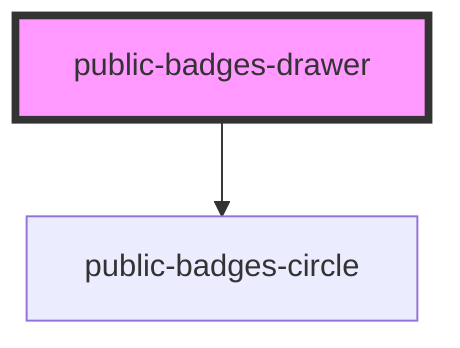

# public-badges-drawer

<!-- Auto Generated Below -->

## Properties

| Property         | Attribute          | Description | Type     | Default     |
| ---------------- | ------------------ | ----------- | -------- | ----------- |
| `badgeColorMode` | `badge-color-mode` |             | `string` | `undefined` |
| `modalColorMode` | `modal-color-mode` |             | `string` | `undefined` |
| `modalZIndex`    | `modal-z-index`    |             | `string` | `undefined` |

## Dependencies

### Depends on

- [public-badges-circle](../public-badges-circle)

### Graph

----------------------------------------------

*Built with [StencilJS](https://stenciljs.com/)*
