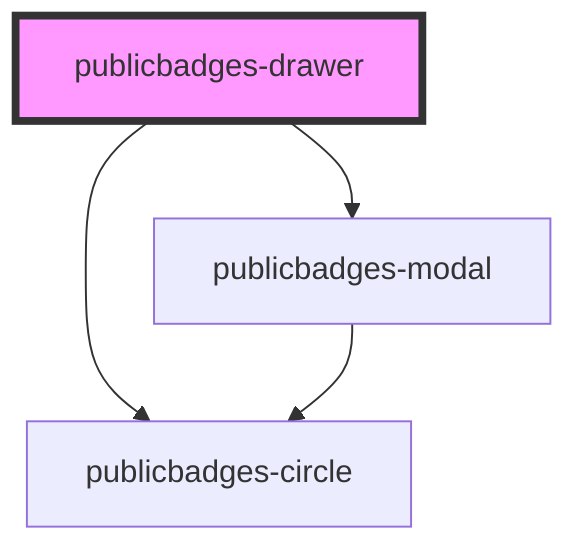

# public-badges-drawer

<!-- Auto Generated Below -->

## Properties

| Property     | Attribute     | Description | Type     | Default |
| ------------ | ------------- | ----------- | -------- | ------- |
| `badgeTheme` | `badge-theme` |             | `string` | `""`    |
| `modalTheme` | `modal-theme` |             | `string` | `""`    |

## Dependencies

### Depends on

- [publicbadges-circle](../public-badges-circle)
- [publicbadges-modal](../public-badges-modal)

### Graph

----------------------------------------------

*Built with [StencilJS](https://stenciljs.com/)*
